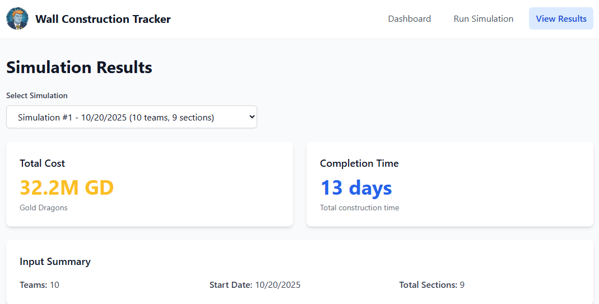

# Wall Construction Tracker



A full-stack application for tracking multi-profile wall construction operations, ice material consumption, and associated costs. Features a React GUI frontend and Django REST API backend.

## Features

- **Wall Construction Simulation**: Parse multi-profile configs and simulate concurrent team construction
- **Multi-Profile Tracking**: Manage multiple construction profiles simultaneously
- **Daily Progress Recording**: Track feet built, ice usage, and costs per day
- **Multi-Threaded Processing**: Parallel section processing with ThreadPoolExecutor
- **Cost Aggregation**: Automatic ice (195 yd³/ft) and cost (1,900 GD/yd³) calculations
- **Interactive GUI**: React frontend with simulation forms, results visualization, and charts
- **Team Activity Logs**: File-based logs tracking team construction progress

## Future Improvements

**Note**: This is a demonstration project. Potential enhancements for production use include:
- PostgreSQL database for better concurrency and replication
- Redis caching for frequently accessed simulation results
- WebSocket support for real-time simulation progress updates
- User authentication and authorization
- API rate limiting and throttling
- Horizontal scaling with load balancing
- Celery task queue for long-running simulations
- Comprehensive logging and monitoring (Prometheus, Grafana)
- CI/CD pipeline with automated deployment
- Docker Compose setup for multi-container orchestration

## API Endpoints

### Simulation

- `POST /api/profiles/simulate/` - Run wall construction simulation from config text
  - Body: `{"config": "21 25 28\n17", "num_teams": 4, "start_date": "2025-10-20"}`
  - Returns: Simulation summary with total days, sections, ice usage, and cost

### Overview & Reporting

- `GET /api/profiles/overview/` - Total cost across all simulations
- `GET /api/profiles/overview/{day}/` - Cost for specific day (all profiles)
- `GET /api/profiles/{id}/overview/{day}/` - Cost for specific day (single profile)
- `GET /api/profiles/{id}/days/{day}/` - Ice usage breakdown for day

### Profiles (CRUD)

- `GET /api/profiles/` - List all profiles
- `POST /api/profiles/` - Create new profile
- `GET /api/profiles/{id}/` - Get profile details
- `PUT /api/profiles/{id}/` - Update profile
- `DELETE /api/profiles/{id}/` - Delete profile

### Wall Sections (CRUD)

- `GET /api/wallsections/` - List all wall sections
- `POST /api/wallsections/` - Create new wall section
- `GET /api/wallsections/?profile={id}` - Filter by profile

## Example Usage

### Run Simulation

```bash
curl -X POST http://localhost:7860/api/profiles/simulate/ \
  -H "Content-Type: application/json" \
  -d '{
    "config": "21 25 28\n17\n17 22 17 19 17",
    "num_teams": 20,
    "start_date": "2025-10-20"
  }'
```

**Response:**
```json
{
  "total_days": 15,
  "total_sections": 9,
  "total_ice_cubic_yards": "82875.00",
  "total_cost_gold_dragons": "157462500.00",
  "simulation_id": 1
}
```

### View Simulation Results

```bash
# Get day 1 ice usage for Profile 1
curl http://localhost:7860/api/profiles/1/days/1/

# Get total cost overview
curl http://localhost:7860/api/profiles/overview/
```

## Local Development

### Setup

```bash
# Install dependencies using uv
uv sync

# Run migrations
uv run python manage.py migrate

# Start development server
uv run python manage.py runserver
```

### Run Tests

```bash
# Run all tests
uv run python -m pytest

# Run with coverage
uv run python -m pytest --cov=apps
```

### Code Quality

```bash
# Run ruff linter
uv run ruff check .

# Run mypy type checker
uv run mypy apps/
```

## Docker Deployment

### Using docker-compose (Recommended)

```bash
# Build and start container
docker-compose up -d

# View logs
docker-compose logs -f

# Stop container
docker-compose down

# Access application
# GUI: http://localhost:7860
# API: http://localhost:7860/api/
```

### Manual Docker Build

```bash
# Build Docker image
docker build -t wall-api .

# Run container
docker run -p 7860:7860 wall-api

# Test API
curl http://localhost:7860/api/profiles/
```

### HuggingFace Space Deployment

This project is configured for deployment to HuggingFace Spaces using Docker.

**Container Architecture:**
- **Frontend**: React SPA served by nginx on port 7860
- **Backend**: Django + Gunicorn on port 8000 (internal)
- **Reverse Proxy**: nginx routes `/api/*` to Django, `/*` to React
- **Process Management**: Supervisor manages both nginx and Django processes

**Database Persistence:**
- Uses SQLite database (`db.sqlite3`)
- Database persists in HuggingFace Space storage
- Automatic migrations on container startup
- No external database service required

## Project Structure

```
demo/
├── apps/profiles/          # Django app for wall construction
│   ├── models.py           # Database models (Simulation, Profile, WallSection, DailyProgress)
│   ├── views/              # API endpoints (simulation, reporting, CRUD)
│   ├── serializers.py      # Data validation and serialization
│   ├── parsers.py          # Configuration parsing and validation
│   ├── services/           # Business logic (WallSimulator, query services)
│   └── constants.py        # Business constants (TARGET_HEIGHT, ICE_PER_FOOT, etc.)
├── frontend/               # React SPA
│   ├── src/
│   │   ├── pages/          # Page components (Dashboard, SimulationForm, SimulationResults)
│   │   ├── App.jsx         # Root component with navigation
│   │   └── index.css       # Global styles + Tailwind CSS
│   ├── public/             # Static assets (logo)
│   └── dist/               # Built frontend (copied to nginx html dir)
├── config/                 # Django settings and URL configuration
├── tests/                  # Unit, integration, and API tests
├── docs/                   # Documentation
│   ├── SPEC-DEMO.md        # Technical specification
│   ├── SPEC-DEMO-GUI.md    # Frontend specification
│   └── SOFTWARE-ARCHITECTURE.md  # Architecture and design decisions
├── pyproject.toml          # Project dependencies (managed by uv)
├── docker-compose.yml      # Docker Compose configuration
├── Dockerfile              # Multi-stage Docker build (frontend + backend)
├── nginx.conf              # nginx reverse proxy configuration
└── supervisord.conf        # Process management configuration
```

## Technology Stack

### Backend
- **Django 5.2.7 LTS** - Web framework
- **Django REST Framework 3.16** - API framework
- **Python 3.12** - Programming language
- **Gunicorn** - WSGI HTTP server
- **uv** - Fast Python package manager
- **SQLite** - File-based database
- **ThreadPoolExecutor** - Parallel cost calculations
- **pytest** - Testing framework

### Frontend
- **React 18** - UI framework
- **Vite 6** - Build tool
- **Tailwind CSS 3** - Utility-first CSS
- **Recharts 2** - Chart library
- **Hash-based routing** - Client-side navigation

### Infrastructure
- **Nginx** - Reverse proxy and static file server
- **Supervisor** - Process control system
- **Docker multi-stage builds** - Optimized deployment

## Development Standards

- Dependencies managed via `pyproject.toml` (NOT requirements.txt)
- Code quality enforced via ruff and mypy (zero tolerance)
- 100% test-driven development with pytest
- Repository pattern for data access
- Service layer for business logic
- Explicit None handling (no implicit defaults)
- Fail-fast error handling (no exception suppression)
